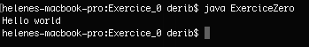

summary: How to write your first class
id: how-to-write-a-java-class
categories: Java
tags: java
status: Published 
authors: Helene de Ribaupierre

# How to Write your first Java class
<!-- ------------------------ -->
## Overview 
Duration: 1

### What You’ll Learn 

- What is a class/object
- how to write an hello world in Object Oriented Programming (OOP) way
- How to compile your java file
- how to run your java file

<!-- ------------------------ -->
## What is OOP programming
Duration: 1

- What is a Class of Object
- In OOP everything is a class (of object)
- A Class is a blueprint of an object that define its properties and behaviour

<!-- ------------------------ -->
## Name of the class
The name of the Class need to be the same than the name of the file.

```java
public class Message {
    ....
}
```
The name of the file need to be <b>Message.java</b>

<!-- ----------------------- -->
## Java Convention for writing classes, methods and Variables
Duration: 2

Java is case sensitive.

Java convention for the naming and writing of the class, method, variable. 

| Type      | Rule for naming         | Example  |
| ------------- |:-------------:| -----:|
| Class     | Upper case. It should be name | AnalyseCase.java |
| Method     | lower case. It should be starting or being a verb     |   getMessage() |
| Variable | lower case. It should be short but meaningful   |    message = "this is a message" |

[link for some naming conventions](https://www.oracle.com/java/technologies/javase/codeconventions-namingconventions.html)

<!-- ----------------------- -->
## First Class
Duration: 2

First create a folder name First_exercise_java

In this folder, create a file <b>Message.java</b>

Copy the following code and save the file. 

```java
public class Message {

	public String getMessage() {
	return "Hello world"
	}
}
```
You create your first class in Java. This class has one function, and this function return the String "Hello World".

<!-- ------------------------ -->
## Using the first class
Duration: 3

In the folder First_exercise_java create a file <b>FirstExercise.java</b>

Copy the following code and save the file. 

```java
public class FirstExercise {

	public static void main (String args[]) {
	
	//creation of an instance of the class message with no parameter in the signature of the constructor
      Message firstMessage = new Message();
      
	//call the method printMessage on the instance of the object Message
	//and store the returned String in a String variable
      String message = firstMessage.getMessage();
      
	//print the String
      System.out.println(message);
    }

}
```
In this second class FirstExercise.java, you are creating an instance of the class message, using the default constructor of the class Message.java.

You are calling the method on the instance of the object Message -> firstMessage

<!-- ------------------------ -->
## Compile and run your first application Java
Duration: 2

Go to your Gitbash/Terminal/Shell, etc.

Go in the directory that contains the two previous file: First_exercise_java

Make sure that both files are in it and type the following:

```shell
javac FirstExercise.java
```
If you don't have errors that appear in your Shell you just have compiled your first java application

Now you want to run it, type the following:

```shell
java FirstExercise
```

You should see this in your Shell



<!-- ------------------------ -->
## Exercise 1
Duration: 8

You have your first application running. 

How could you tranform this application that you could display:
- "Hello World"
- "Java is my new favorite language"
- "Java is better for OOP than python"


Tips, you only have two little changes to make
<!-- ------------------------ -->

